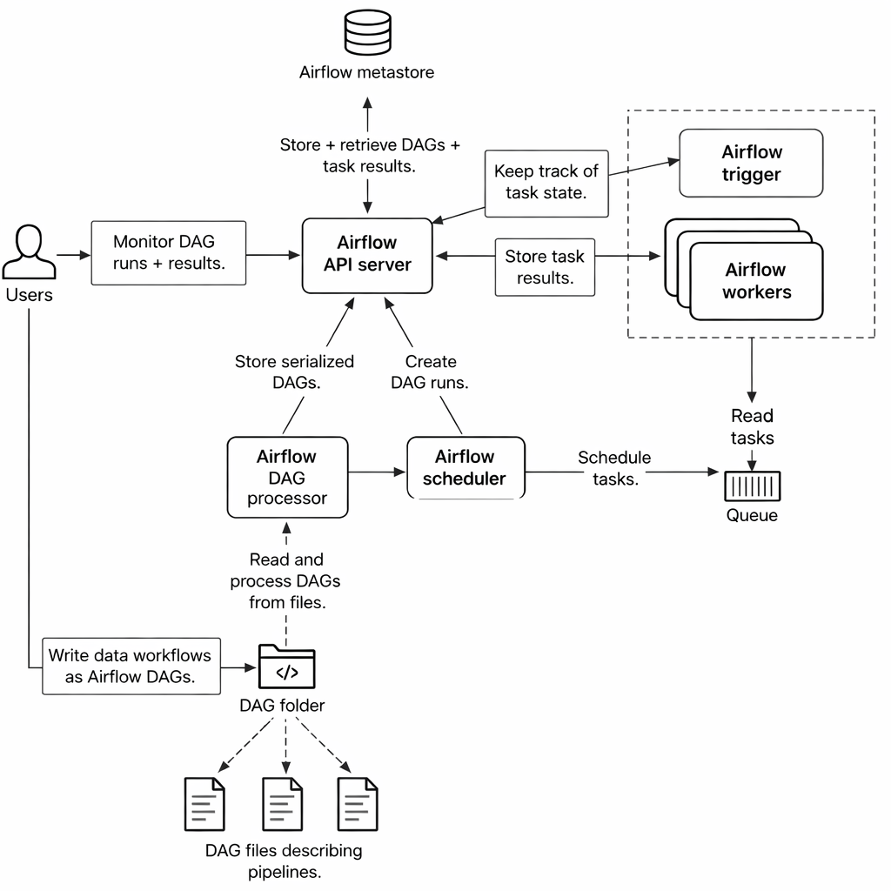
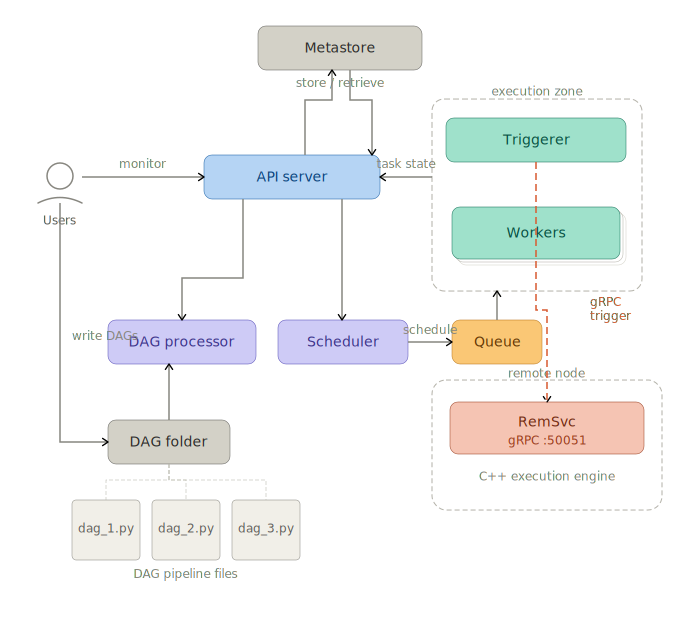

# RemSvc — Remote Execution Service

**RemSvc** is a gRPC-based remote execution service that allows authorized callers to execute Shell (Bash/Cmd) or PowerShell commands on a remote host. All communication occurs over an encrypted channel using **gRPC** and **Protocol Buffers (Protobuf)** serialization.

## Core Features
* **Decoupled Design:** While built for the Apache Airflow ecosystem, RemSvc does not require access to Airflow instances, databases, or internal implementation details.
* **Agnostic Execution:** Commands are treated as a stream of strings; the service executes them and returns the output and status code to the caller.
* **High Performance:** Leverages **HTTP/2** capabilities, including bidirectional streaming and port multiplexing, allowing a single RemSvc instance to serve multiple clients through a single TCP port.

## Security Posture
RemSvc provides a robust security framework to protect remote hosts:
* **TLS Encryption:** Full transport-level encryption.
* **Authentication:** Client verification via Bearer Tokens.
* **Integrity:** Command hashing to detect tampering.
* **Access Control:** Service-level **Allow and Deny lists** for specific commands.
* **OS-Level Restrictions:** On systems that support effective user changes (primarily Unix), RemSvc can drop privileges to restrict process capabilities.
* **Defense in Depth:** Designed to work alongside platform, process, and file-level access controls to further reduce the attack surface.

## Apache Airflow Integration
This project includes a dedicated provider, `airflow-provider-remsvc`, which introduces the `remsvc://` URI notation.

### Key Integration Benefits:
* **RemSvcOperator:** Easily trigger remote commands within your DAGs and collect results via **XComs**.
* **Asynchronous Execution:** Remote calls are managed by the **Airflow Triggerer**. This prevents Airflow workers from being occupied during long-running remote executions, optimizing resource utilization.
* **Cloud Agnostic:** This architecture allows Airflow to manage a large fleet of servers across private data centers and public/hybrid cloud environments.

## Project Structure
This project utilizes a **monorepo** pattern consisting of two independently deployable components that share a single `.proto` contract:

1.  **Service (Server):** The gRPC server residing on the target host.
2.  **Provider (Client):** The Airflow-specific integration layer.

| Component                  | Language              | Location |
| -------------------------- | --------------------- | -------- |
| gRPC server / CLI client   | C++20 (Qt 6, CMake)   | `src/`   |
| Apache Airflow provider    | Python 3.10+          | `prv/`   |

Author: Semih Cemiloglu

---

## Architecture

### Airflow architecture, functional components

### Airflow components, augmented with RemSvc 


> See the [`doc/`](doc/) directory for detailed Mermaid diagrams:
> - [Airflow deferrable execution flow](doc/diagram-airflow-deferrable-flow.md)
> - [Deployment topology & security boundary](doc/diagram-deployment-topology.md)
> - [RemCmdStrm tid correlation](doc/diagram-remcmdstrm-tid-correlation.md)

```
src/proto/RemSvc.proto          ← single source of truth (service contract)
│
├── src/server/                 ← C++ gRPC server (RemSvc_server.exe)
│   ├── RemSvcServiceImpl       ← RPC handlers, command execution via QProcess
│   └── ServerConfig / CLI      ← INI config + CLI flag overlay
│
├── src/client/                 ← C++ CLI client (RemSvc_client.exe)
│
├── src/pyclient/               ← Python CLI client + stub generator
│
├── prv/                        ← Apache Airflow provider package
│   ├── remsvc_provider/
│   │   ├── hooks/remsvc.py     ← connection management (TLS, channel pool)
│   │   ├── operators/remsvc.py ← deferrable operator
│   │   └── triggers/remsvc.py  ← async trigger (RemCmdStrm bidirectional stream)
│   └── remsvc_proto/           ← auto-generated Python gRPC stubs (built on install)
│
└── doc/                        ← Documentation
    ├── ... (Various design diagrams)
    └── samples/                ← Sample DAGs for end-to-end testing
        ├── dag_remsvc_e2e_windows.py
        └── dag_remsvc_e2e_linux.py
```

### Command execution model

Each command is executed in a dedicated OS child process spawned via `QProcess`
(`cmd.exe /C` on Windows, `/bin/sh -c` on Linux for `cmdtyp=0`; `powershell.exe`
on Windows or `pwsh` on Linux for `cmdtyp=1`).  Every command gets its own
address space, PID, and stdio pipes; when it exits the process is reaped and all
resources are released.  No threads are involved in command execution — the gRPC
server thread calls the runner synchronously and blocks until the child process
finishes.

For the streaming RPC (`RemCmdStrm`), the server processes incoming messages
sequentially — one child process at a time — while the Airflow trigger sends all
commands and reads all responses concurrently via `asyncio.gather`.  If two
Airflow tasks target the same server at the same time their messages will be
interleaved at the gRPC level, but each command still runs in its own isolated
child process and they do not share any process state.

### gRPC Service Methods

| Method        | Type                    | Description                                                                                           |
| ------------- | ----------------------- | ----------------------------------------------------------------------------------------------------- |
| `Ping`        | Unary                   | Health check — echoes back the sequence number and payload                                            |
| `GetStatus`   | Unary                   | Returns server uptime and total commands executed                                                     |
| `RemCmd`      | Unary                   | Execute one command synchronously, return stdout/stderr and exit code                                 |
| `RemCmdStrm`  | Bidirectional streaming | Execute N commands over a single stream; server dispatches sequentially, responses correlated by `tid` |

### Command fields (`RemCmdMsg`)

| Field     | Type     | Description                                                             |
| --------- | -------- | ----------------------------------------------------------------------- |
| `cmd`     | `string` | Command string to execute                                               |
| `cmdtyp`  | `int32`  | `0` = native shell (`cmd.exe /C` / `/bin/sh -c`), `1` = PowerShell    |
| `cmdusr`  | `string` | Run as this OS user (Linux only; ignored on Windows)                    |
| `tid`     | `int32`  | Transaction ID — assigned 1-based by the caller, echoed in the response |
| `src`     | `string` | Caller identifier (included in server-side log entries)                 |
| `hsh`     | `string` | CRC-32 hex of `cmd` — server verifies integrity on receipt              |

---

## C++ Build

**Requirements:** CMake ≥ 3.18.4, VCPKG, Qt 6.

#### Windows (Visual C++)

Ninja is a single-config generator — the build type is fixed at configure
time, not at build time.  Two presets are provided:

| Preset      | Build type | Binary dir   | Use for                        |
| ----------- | ---------- | ------------ | ------------------------------ |
| `bld_vc`    | Debug      | `bld_vc/`    | Development and unit tests     |
| `bld_vc_rel`| Release    | `bld_vc_rel/`| Deployment packaging           |

```bash
# Set VCPKG_ROOT to your VCPKG installation
set VCPKG_ROOT=C:\path\to\vcpkg

# Debug build (development)
cmake --preset=bld_vc
cmake --build bld_vc
ctest --test-dir bld_vc

# Release build (deployment)
cmake --preset=bld_vc_rel
cmake --build bld_vc_rel
ctest --test-dir bld_vc_rel
```

Key build outputs (release):

| Binary                                | Description |
| ------------------------------------- | ----------- |
| `bld_vc_rel/server/RemSvc_server.exe` | gRPC server |
| `bld_vc_rel/client/RemSvc_client.exe` | CLI client  |

#### Linux (GCC / Clang)

```bash
# Configure — bld_gcc is the conventional build directory name on Linux.
# Dependencies (gRPC, Qt6, absl, …) are resolved from stow prefixes
# auto-detected by CMakeLists.txt; no VCPKG toolchain is required.
cmake -B bld_gcc -G Ninja -S. -DCMAKE_BUILD_TYPE=Release

# Build all targets
cmake --build bld_gcc

# Run C++ unit tests
ctest --test-dir bld_gcc -V
```

Key build outputs:

| Binary                        | Description |
| ----------------------------- | ----------- |
| `bld_gcc/server/RemSvc_server` | gRPC server |
| `bld_gcc/client/RemSvc_client` | CLI client  |

### Packaging — Linux (TGZ / DEB)

After a successful build, stage the install tree and produce the archives:

```bash
# Run cpack from inside the build directory so the archives land there.
# DeployLinux.cmake runs as part of staging: it collects all non-system
# shared libraries (gRPC, protobuf, absl, Qt6, ICU, …) via ldd and writes
# a launcher script that sets LD_LIBRARY_PATH before exec-ing the binary.
cd bld_gcc && cpack
# → bld_gcc/RemSvc-1.0.0-linux-x64.tar.gz
# → bld_gcc/RemSvc-1.0.0-linux-x64.deb
```

The TGZ (and DEB) extracts to:

```
RemSvc-1.0.0-linux-x64/
├── bin/
│   ├── RemSvc_server          ← gRPC server binary
│   ├── RemSvc_server.sh       ← launcher (sets LD_LIBRARY_PATH, then exec's the binary)
│   └── RemSvc_client          ← CLI client binary
└── lib/
    └── libgrpc.so.*, libprotobuf.so.*, libQt6Core.so.*, …  ← all bundled shared libs
```

Always use `RemSvc_server.sh` as the entry point — it sets `LD_LIBRARY_PATH`
to the co-located `lib/` directory before executing the binary, so no
system-wide library installation is required.

To deploy: extract the TGZ (or install the DEB) on the target host, write a
config file, then install as a systemd service.  See
[doc/linux-service-install.md](doc/linux-service-install.md) for step-by-step
instructions covering both system-wide (root) and user-mode (no root) setups.

### Packaging — Windows (ZIP)

After a successful build, create the self-contained deployment ZIP:

```bash
# Run cpack from inside the release build directory so the archive lands there.
# The install rules run windeployqt (Qt DLLs), DeployWindows.cmake
# (gRPC/protobuf/absl/BoringSSL DLLs), and InstallRequiredSystemLibraries
# (MSVC runtime DLLs) as part of staging.
cd bld_vc_rel && cpack
# → bld_vc_rel/RemSvc-1.0.0-win64.zip
```

The ZIP extracts to:

```
RemSvc-1.0.0-win64/
├── bin/
│   ├── RemSvc_server.exe          ← gRPC server
│   ├── RemSvc_client.exe          ← CLI client
│   ├── Qt6Core.dll, …             ← Qt runtime (windeployqt)
│   ├── libprotobuf.dll, abseil_dll.dll, …  ← protobuf / absl / BoringSSL / re2 / cares / zlib (gRPC statically linked into exe)
│   ├── vcruntime140.dll, …        ← MSVC C++ runtime
│   └── install-service.ps1        ← Windows service setup script (NSSM)
└── config/
    └── server.ini.example         ← annotated configuration template
```

**Minimum OS requirement:** Windows Server 2019 version 1903 or later (or
Windows Server 2022).  Qt 6.x uses the Windows system ICU library (`icu.dll`
in `System32`), which was added in Windows 10/Server 1903.  Earlier builds
lack `icu.dll` and will fail to start the server.

To deploy: extract the ZIP on the target host, copy
`config\server.ini.example` to a permanent location (e.g.
`C:\ProgramData\RemSvc\remsvc.ini`), edit it, then run
`bin\install-service.ps1` from an elevated PowerShell prompt.  See
[doc/windows-service-install.md](doc/windows-service-install.md) for details.

### Server configuration (INI file)

All settings are optional — absent keys keep their default values.  CLI flags
override INI values when both are supplied.

```ini
[server]
port=50051
cmd_timeout_ms=30000          ; per-command child-process kill timeout (ms)

[tls]
enabled=false
cert=$HOME/certs/server.crt   ; $VAR and ${VAR} expansion is supported
key=$HOME/certs/server.key
ca=                           ; empty = server-side TLS only; set for mutual TLS

[auth]
; Bearer-token authentication.  Key = identity label (logged on each auth).
; Value = secret bearer token.  Empty section = auth disabled.
; Token values support $VAR expansion to avoid plaintext secrets in the file.
; NOTE: [auth] requires TLS — the server refuses to start if tokens are
; configured without [tls] enabled=true.
airflow-prod    = $REMSVC_PROD_TOKEN
airflow-staging = $REMSVC_STAGING_TOKEN

[denylist]
; std::regex (ECMAScript) patterns — a command matching ANY deny pattern is
; rejected with PERMISSION_DENIED, regardless of the allowlist.
; Empty section = no commands are denied by this list.
; A malformed pattern causes the server to start in deny-all mode.
1=^rm\b
2=^del\b
3=shutdown

[allowlist]
; std::regex (ECMAScript) patterns — a command must match at least one.
; Empty section = all commands are permitted (subject to the denylist above).
; A malformed pattern causes the server to start in deny-all mode.
; Evaluation order: denylist is checked first; allowlist is checked second.
1=^echo\b
2=^hostname$

[log]
file=RemSvc_server.log
level=info                    ; trace|debug|info|warn|error
debug_level=-1                ; -1 = off; 0-9 = verbose debug
```

Start the server with an INI file; individual flags override config values:

```bash
# Minimal (no auth, no TLS — development only)
RemSvc_server.exe --config server.ini

# Override port and timeout at launch
RemSvc_server.exe --config server.ini --port 9090 --cmd-timeout-ms 60000

# TLS without a config file
RemSvc_server.exe --port 50051 --tls --cert server.crt --key server.key

# Mutual TLS (client certificate required)
RemSvc_server.exe --tls --cert server.crt --key server.key --ca-cert ca.pem

# CLI allowlist and denylist (replace the INI lists when supplied)
RemSvc_server.exe --config server.ini --allow "^echo\b" --allow "^hostname$" --deny "^rm\b"
```

Full CLI reference:

| Flag                    | Default  | Description                                                           |
| ----------------------- | -------- | --------------------------------------------------------------------- |
| `--config`              | —        | INI configuration file                                                |
| `--port`                | `50051`  | Listening port                                                        |
| `--tls`                 | off      | Enable TLS                                                            |
| `--cert`                | —        | Server certificate PEM (required with `--tls`)                        |
| `--key`                 | —        | Server private key PEM (required with `--tls`)                        |
| `--ca-cert`             | —        | CA certificate PEM; enables mutual TLS (client certificate required)  |
| `--cmd-timeout-ms`      | `30000`  | Per-command child-process kill timeout in milliseconds                |
| `--deny`                | —        | Denied command regex (repeatable; replaces the INI denylist); evaluated before `--allow` |
| `--allow`               | —        | Allowed command regex (repeatable; replaces the INI allowlist)        |
| `--log-level-override`  | —        | Override log level: `trace` \| `debug` \| `info` \| `warn` \| `error` |
| `--log-file-override`   | —        | Override log file path from config                                    |

---

## Python Airflow Provider

### Installation

**From PyPI** (production use):

```bash
pip install airflow-provider-remsvc
```

The package is available at [pypi.org/project/airflow-provider-remsvc](https://pypi.org/project/airflow-provider-remsvc/).
It includes pre-generated gRPC stubs — no protoc or extra build tools required.

**From source** (development):

```bash
cd prv/
pip install -e ".[dev]"
```

The Hatchling build hook generates the Python gRPC stubs from `src/proto/RemSvc.proto`
automatically — no manual stub generation step is required.

### Airflow Connection Setup

Create a connection of type `remsvc`:

```bash
# Insecure, no auth (development only)
export AIRFLOW_CONN_REMSVC_DEFAULT='remsvc://remotehost:50051?extra={}'

# TLS, no auth
export AIRFLOW_CONN_REMSVC_DEFAULT='remsvc://remotehost:50051?extra={"use_ssl":true,"ca_cert_path":"/etc/ssl/ca.pem"}'

# TLS + bearer token (required for auth — server rejects auth tokens over a plaintext channel)
export AIRFLOW_CONN_REMSVC_DEFAULT='remsvc://remotehost:50051?extra={"use_ssl":true,"ca_cert_path":"/etc/ssl/ca.pem","bearer_token":"secret-prod-token"}'
```

| `extra` field    | Type   | Description                                                                                                |
| ---------------- | ------ | ---------------------------------------------------------------------------------------------------------- |
| `use_ssl`        | bool   | Enable TLS (default: `false`)                                                                              |
| `ca_cert_path`   | string | Path to CA certificate PEM; uses the system trust store if omitted with `use_ssl: true`                   |
| `bearer_token`   | string | Secret token sent as `Authorization: Bearer <token>` on every call; must match a server `[auth]` entry    |

### Usage in a DAG

```python
from remsvc_provider.operators.remsvc import RemSvcOperator

run_remote = RemSvcOperator(
    task_id="run_remote",
    grpc_conn_id="remsvc_default",
    commands=[
        {"cmd": "echo {{ ds }}", "cmdtyp": 0},
        {"cmd": "hostname",      "cmdtyp": 0},
    ],
    stream_timeout=300,
    dag=dag,
)
```

The operator is **deferrable**: the worker slot is released while commands
execute on the remote host.  When all commands complete, the triggerer fires a
`TriggerEvent` and the worker resumes to push results to XCom.

See [doc/diagram-airflow-deferrable-flow.md](doc/diagram-airflow-deferrable-flow.md)
for a full sequence diagram of the three-phase execution lifecycle.

#### XCom output schema

```json
{
  "state":   "SUCCESS",
  "results": [
    {"tid": 1, "rc": 0, "out": "2024-01-01\n", "err": "", "hsh": "3610a686", "cmd": "echo ..."},
    {"tid": 2, "rc": 0, "out": "myhost\n",      "err": "", "hsh": "a1b2c3d4", "cmd": "hostname"}
  ],
  "error_msg": null
}
```

Results are always sorted ascending by `tid` (i.e. original command order).

### Running tests

On a fresh host, run these steps once before invoking pytest:

```bash
cd prv/

# 1. Install the package and all dev dependencies.
#    The Hatchling build hook generates the Python gRPC stubs automatically
#    into remsvc_proto/: RemSvc_pb2.py and RemSvc_pb2_grpc.py
#    If stubs are missing after install, run: ./regen_proto.sh
pip install -e ".[dev]"

# 2. Run the full test suite
pytest
```

Or from the repo root without `cd`:

```bash
PYTHONPATH=prv pytest tst/unit/prv
```

### Regenerating gRPC stubs manually

Required on a fresh host if `pip install` did not generate them, or any time
`src/proto/RemSvc.proto` changes:

```bash
cd prv/
chmod +x regen_proto.sh   # only needed once
./regen_proto.sh
```

---

## Security

### Authentication (bearer token)

The server supports per-call bearer-token authentication via the `[auth]` INI
section.  Each entry maps a human-readable identity label to a secret token:

```ini
[auth]
airflow-prod    = secret-prod-token
airflow-staging = secret-staging-token
dev-semih       = secret-dev-token
```

The server-side `BearerTokenAuthProcessor` runs before every RPC handler.  It:

- Reads the `Authorization: Bearer <token>` gRPC metadata header from the call
- Iterates the full token map using a constant-time comparison (no early exit,
  preventing timing side-channels)
- On match: stamps the verified identity onto the gRPC `AuthContext` as
  `x-remsvc-identity` and logs `authenticated identity='airflow-prod'`
- On miss or absent header: immediately returns `UNAUTHENTICATED`; the RPC
  handler never runs; the rejected token is **never** written to logs

An absent or empty `[auth]` section disables authentication — all callers are
permitted (backwards-compatible with unauthenticated deployments).

> **Revocation:** remove the token entry from the INI file and restart the server.

### TLS

Enable `[tls] enabled=true` and supply cert/key paths.  Cert paths support
`$VAR` / `${VAR}` environment-variable expansion.  For mutual TLS, supply a
`ca=` path — the server then requires clients to present a certificate signed
by that CA.

> Bearer tokens over a plaintext channel provide identity but not
> confidentiality.  Always use TLS in production.

### Command filtering (denylist + allowlist)

Inbound commands are filtered through two independent regex lists before
execution.  Both lists use `std::regex` ECMAScript patterns.  The evaluation
order is fixed: **denylist is checked first, allowlist is checked second**.

A command is executed if and only if:
1. It does **not** match any pattern in `[denylist]` (if the denylist is non-empty), **and**
2. It matches at least one pattern in `[allowlist]` (if the allowlist is non-empty).

| List | INI section | CLI flag | Empty list behaviour |
|------|-------------|----------|----------------------|
| Denylist | `[denylist]` | `--deny` | No commands are denied by this list |
| Allowlist | `[allowlist]` | `--allow` | All commands are permitted |

A malformed regex pattern in either list causes the server to enter **deny-all**
mode at startup — every command is rejected with `PERMISSION_DENIED` until the
config is corrected and the server restarted.  This is a deliberate fail-safe:
a bad pattern must never silently open an unintended hole.

### Integrity checking

All clients (C++ CLI client, Python CLI client, and Airflow trigger) include a
CRC-32 hex hash (`hsh` field) of each command string in every `RemCmdMsg`.  The
server verifies the hash on receipt and rejects requests where it does not match,
guarding against in-flight modification of command strings.

### Output truncation

Command output exceeding 256 KB is truncated server-side.  The truncation
marker `\x01[remSvc: output truncated at 262144 bytes]\x01` uses SOH sentinel
bytes so it cannot be confused with legitimate command output.

---

## Diagrams

| Diagram                              | Format  | Description                                                   |
| ------------------------------------ | ------- | ------------------------------------------------------------- |
| [Architecture overview](doc/architecture-component.png) | PNG | Component layout across Airflow and remote host |
| [Airflow deferrable flow](doc/diagram-airflow-deferrable-flow.md) | Mermaid | Three-phase operator lifecycle, retry loop, slot occupancy |
| [Deployment topology](doc/diagram-deployment-topology.md) | Mermaid | Host boundaries, gRPC channel, security enforcement chain |
| [RemCmdStrm tid correlation](doc/diagram-remcmdstrm-tid-correlation.md) | Mermaid | Happy path, missing response, and non-zero rc error paths |
