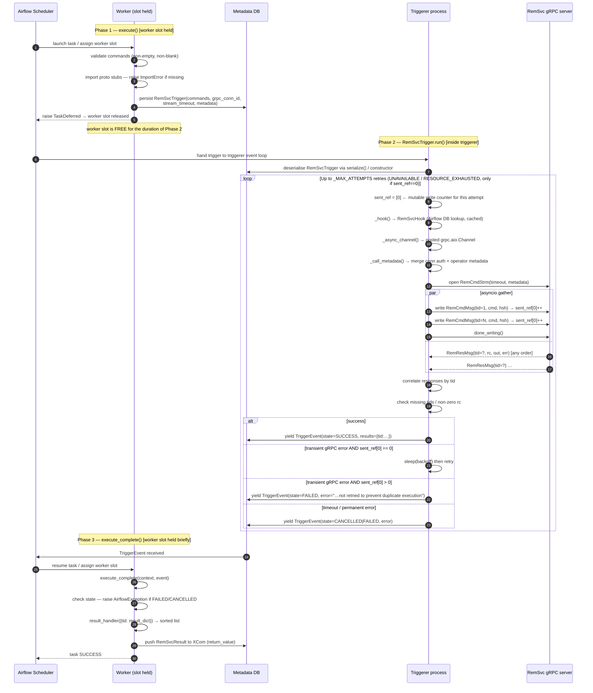

# Diagram: Airflow Deferrable Execution Flow

Shows the three-phase lifecycle of a `RemSvcOperator` task.
The worker slot is held only during the brief validation and XCom-push phases;
all command execution and waiting happens inside the triggerer process.

## Notes

- **Worker slot occupancy:** held only during steps 1–4 (validate + defer) and
  steps 18–22 (resume + XCom push).  The entire gRPC stream runs in the
  triggerer with zero worker slots consumed.
- **Retry policy:** `UNAVAILABLE` and `RESOURCE_EXHAUSTED` are retried up to
  `_MAX_ATTEMPTS` (3) times with exponential backoff (1 s → 2 s → 4 s, capped
  at 16 s), **but only when no writes have been dispatched in that attempt**
  (`sent_ref[0] == 0`).  If the connection drops after one or more commands have
  already been written, the trigger fails immediately with `FAILED` rather than
  retrying — retrying would resend all commands from the top, causing duplicate
  execution of non-idempotent commands on the remote host.
  `DEADLINE_EXCEEDED`, `asyncio.TimeoutError`, and all other errors fail
  immediately without retry regardless of how many commands were sent.
- **Channel pool:** `_async_channel()` returns a module-level pooled
  `grpc.aio.Channel` shared across all concurrent triggers targeting the same
  host/TLS configuration.  The channel is never closed by the trigger.
- **Auth metadata:** the connection-level `bearer_token` always takes precedence
  over any `authorization` header in the operator's `metadata` parameter.
