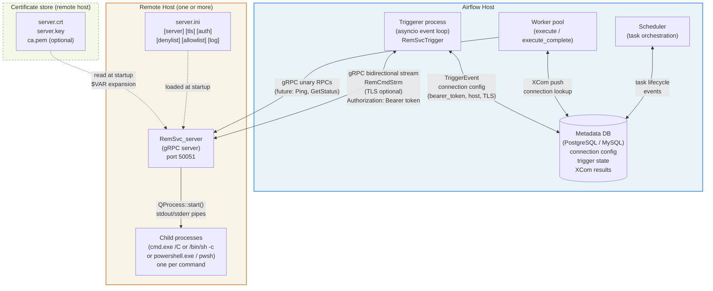

# Diagram: Deployment Topology

Shows how the RemSvc components are distributed across hosts and what
communication channels exist between them.

## Security boundary

```mermaid
graph LR
    subgraph untrusted ["Network (untrusted)"]
        direction LR
        CH["gRPC channel\nTCP 50051"]
    end

    subgraph airflow_side ["Airflow side"]
        AMETA["bearer_token\n(Airflow connection extra)\nnever logged"]
    end

    subgraph server_side ["Server side"]
        AUTH["BearerTokenAuthProcessor\n(runs before every RPC)\nconstant-time comparison"]
        DENY["Command denylist\n(std::regex)\nchecked first — deny wins"]
        ALLOW["Command allowlist\n(std::regex)\nchecked second"]
        EXEC["runInProcess()\ncmdTimeoutMs kill deadline"]
    end

    AMETA -->|"Authorization: Bearer token\n(encrypted if TLS enabled)"| CH
    CH    -->|"gRPC metadata header"| AUTH
    AUTH  -->|"identity stamped on AuthContext\nx-remsvc-identity"| DENY
    DENY  -->|"no deny pattern matched"| ALLOW
    ALLOW -->|"allow pattern matched\n(or allowlist empty)"| EXEC

    AUTH  --x|"UNAUTHENTICATED\n(token mismatch or absent)"| X1[ ]
    DENY  --x|"PERMISSION_DENIED\n(deny pattern matched)"| X2[ ]
    ALLOW --x|"PERMISSION_DENIED\n(no allow pattern matches)"| X3[ ]
    EXEC  --x|"killed + rc≠0\n(timeout exceeded)"| X4[ ]

    style untrusted    fill:#fff0f0,stroke:#cc4444,stroke-width:1px,stroke-dasharray:4
    style airflow_side fill:#e8f4f8,stroke:#4a90d9,stroke-width:2px
    style server_side  fill:#f8f4e8,stroke:#d9904a,stroke-width:2px
```

## Component inventory

| Component | Host | Binary / Package | Notes |
|-----------|------|-----------------|-------|
| Airflow Scheduler | Airflow host | Airflow built-in | Manages task state machine |
| Airflow Worker | Airflow host | Airflow built-in | Holds slot only during validate + XCom push |
| Airflow Triggerer | Airflow host | `airflow-provider-remsvc` | Runs `RemSvcTrigger` coroutines |
| RemSvc gRPC server | Remote host | `RemSvc_server.exe` | Long-running process; config via `server.ini` |
| RemSvc CLI client | Any host | `RemSvc_client.exe` | Ad-hoc / scripting use |
| gRPC stubs | Airflow host | `remsvc_proto/` | Auto-generated at `pip install` time |
