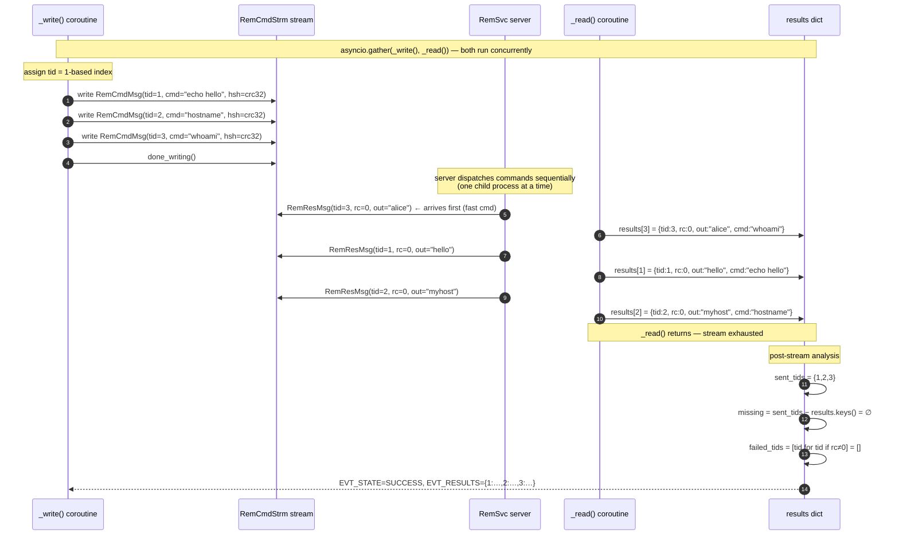
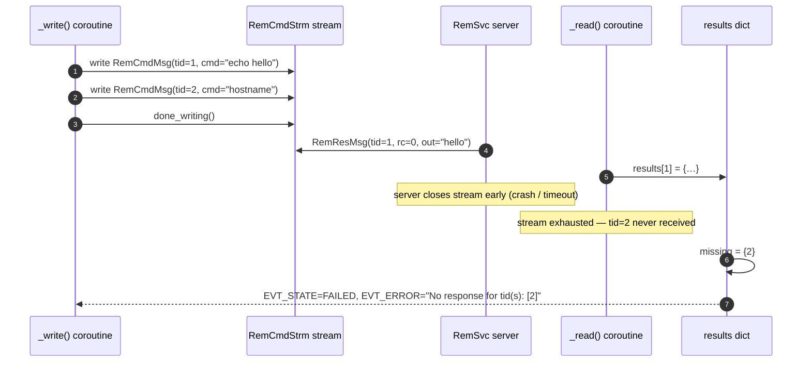
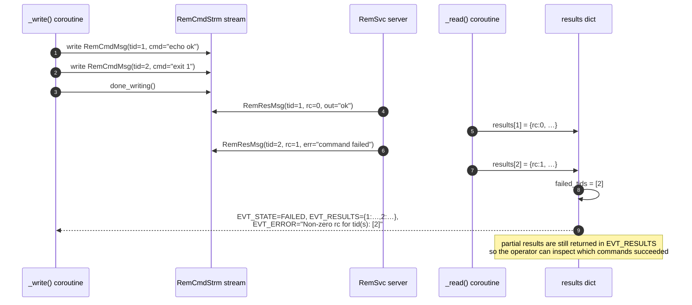

# Diagram: RemCmdStrm tid Correlation

Shows how transaction IDs (`tid`) are assigned by the trigger, echoed by the
server, and used to correlate out-of-order responses back to their originating
commands.

## Happy path — three commands, responses arrive out of order

## Error path — missing response

## Error path — non-zero exit code

## tid assignment rules

| Rule | Detail |
|------|--------|
| Assigned by | Python trigger (`_run_stream`) and C++ client (`doRemCmdStrm`) |
| Value | 1-based index in the `commands` list — first command is `tid=1` |
| Echoed by | Server copies `tid` from request into `RemResMsg` unchanged |
| Out-of-order | Responses may arrive in any order; `results[tid]` handles this |
| Duplicate | Last response wins (warning logged); impossible in practice (server echoes each request once) |
| Missing | `sent_tids − results.keys()` detected post-stream → `FAILED` |
| Zero | `tid=0` means unset (proto default); reserved — never assigned by clients |
